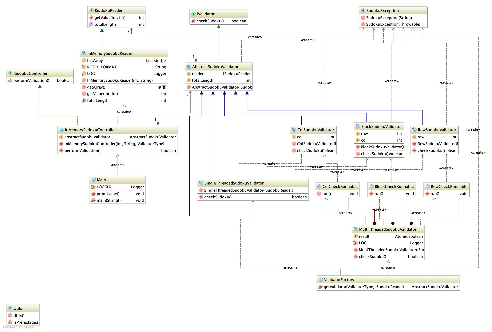

Basic Requirement
============================
### 1. The grid will be square (same number of rows and columns). The length of a side should have a integer value square root. Valid side lengths would include: 1, 4, 9,16, etc.
### 2. The grid can be divided into square regions of equal size where the size of a region is equal to the square root of a side of the entire grid. Each region will have the same number of cells as rows in the grid. On a 16x16 grid there would be 16 regions of size 4x4.
### 3. The numbers that can be used are in the range from 1 to N where N is the length of a side.
### 4. All the number with in a given row, column and region should be unique 
 
 Class Diagram
============================

Assumption
=====================
### * Program will take two inputs
##### 1. The length of side of Sudoku puzzle
##### 2. Input file name from where program will read all the numbers 
 
### * As par the current Implementation this program will keep all the number in the two dimensional array in the memory

### * In order to build and execute this program, following software are required.
##### 1. JDK 1.6
##### 2. Maven 3.0.x

Building and Execution
=======================
##### 1. Check out the Git repository
    git clone https://github.com/deyindra/Sudoku.git
    
##### 2. Run following maven command to build the project
    mvn clean install

##### 3. Go to the target folder after build is finshed and un-tar "Sudoku-bin.tar"
        cd target
        mkdir releases
        cd releases
        tar -xvf ../Sudoku-bin.tar
        
##### 4. Execute the following command to check if the sudoku solution is valid or not
        java -jar Sudoku-1.0-SNAPSHOT.jar <<Length of the Side of the Sudoku plus game>> <<Input file which contains all the number as comma seperated value>>

        Please note while reading from input files program will determine if all the numbers from ranging from 1 to N where N is the length of the side

        
Current Limitation and Enhancement
===================================
        
### 1 Currently all the inputs are stored in 2 dimensional array in the memory. This is initially good for small set of number. But. not certainly good for large number of inputs. Perhaps, this can be enhanced to read the structure from the disk in case inputs are too large.
### 2 Currently checking all number(s) row wise, column wise and region wise are happening in a sequential order. This is certainly good for small set of inputs, e.g. 4X4 or 9X9 or 16X16. But if the set of inputs are too big then processing row wise, column wise and region wise sequentially will take longer time. This can be improved by running all these three checks in parallel and update the global variable (e.g. AtomicBoolean) in case one of the validation failed and come out of the loop gracefully. 
 
  
